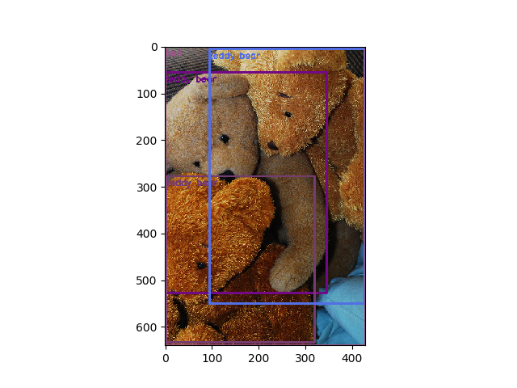
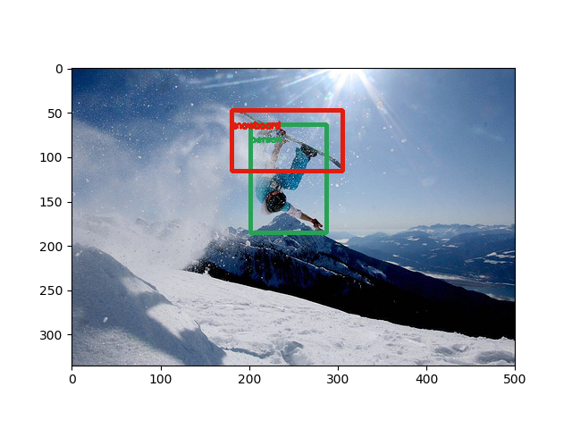

# Project
Pytorch version of the experiencor's keras YOLOv2 implementation https://github.com/experiencor/keras-yolo2 

## Getting Started

### Prepare the COCO dataset
create a folder for COCO dataset 
```
mkdir COCO/
cd COCO/
```
download the data from the COCO website by running: 
```
wget http://images.cocodataset.org/zips/train2014.zip 
wget http://images.cocodataset.org/zips/val2014.zip 
wget http://images.cocodataset.org/annotations/annotations_trainval2014.zip 
```
unzip all above zip files:
```
unzip train2014.zip
unzip val2014.zip
unzip annotations_trainval2014.zip 
```
create two subfolders in the COCO/ folder to store Pascal VOC format annotations:
```
mkdir train2014_annotations/ 
mkdir val2014_annotations/
```
git clone this repo to your computer and use the coco2pascal.py script to convert COCO annotation format to Pascal VOC format 
```
git clone https://github.com/shangranq/Yolov2-Pytorch.git
cd Yolov2_Pytorch/
python coco2pascal.py create_annotations COCO/ train COCO/train2014_annotations/ 
python coco2pascal.py create_annotations COCO/ val COCO/val2014_annotations/  
```

So far the dataset has been prepared and the data folder structure should be the same as:
``` 
├── COCO
     ├──train2014                    # training set images
     ├──val2014                      # validation set images
     ├──train2014_annotations        # Pascal VOC format training set annotation
     ├──val2014_annotations          # Pascal VOC format validation set annotation 
     |──annotations                  # original COCO annotation 
``` 

### Visualize the COCO dataset
Before we move to the model training and testing, we can visualize some sample images with anchor boxes and labels by runnnig
```
python util.py
```
The generated images will be saved in the sample folder and here are some samples:
 
 


## train the model
To train the model, run:
```
python train.py -c config.json
```
The config.json passes in the hyperparameters and data paths into the train.py script. To fine tune the hyperparameters, you only need to change the config.json, which looks like below 
```
{
    "model" : {
        "backend":              "MobileNet",
        "input_size":           416,
        "anchors":              [0.57273, 0.677385, 1.87446, 2.06253, 3.33843, 5.47434, 7.88282, 3.52778, 9.77052, 9.16828],
        "max_box_per_image":    50,
        "labels":               []
    },

    "train": {
        "train_image_folder":   "/data/datasets/COCO/train2014/",
        "train_annot_folder":   "/data/datasets/COCO/train2014_annotations/",

        "train_times":          1,
        "pretrained_weights":   "",
        "batch_size":           16,
        "learning_rate":        1e-4,
        "nb_epochs":            10,
        "warmup_epochs":        0,

        "object_scale":         5.0 ,
        "no_object_scale":      1.0,
        "coord_scale":          1.0,
        "class_scale":          1.0,

        "saved_weights_name":   "full_yolo.pth",
        "debug":                true
    },

    "valid": {
        "valid_image_folder":   "",
        "valid_annot_folder":   "",
        "valid_times":          1
    },

    "test": {
        "test_image_folder":   "/data/datasets/COCO/val2014/",
        "test_annot_folder":   "/data/datasets/COCO/val2014_annotations/",
        "test_times":          1
    }
}
```

## evaluate the model
At the end of the training, mAP was evaluated, this implementation mAP is 0.1896. 
Visualize some of the testing images with ground truth and predicted bounding boxes. 


