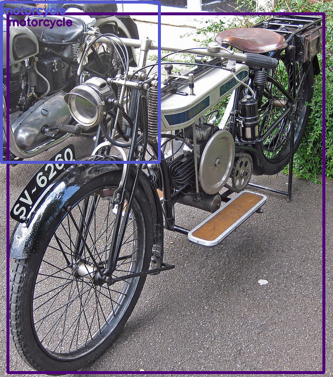
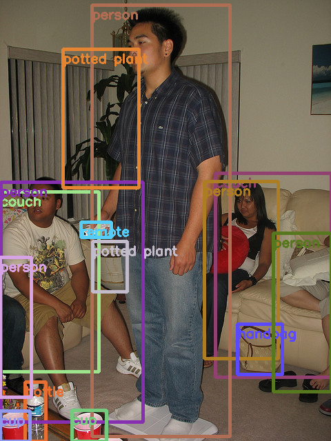
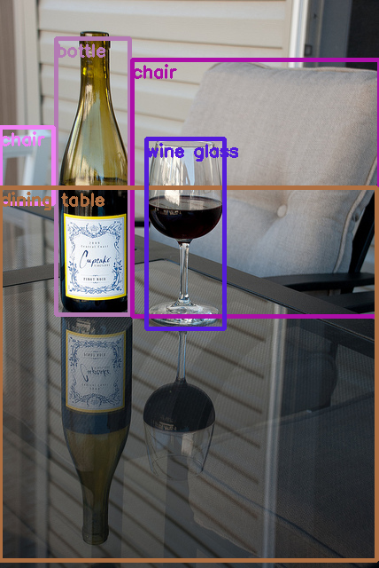
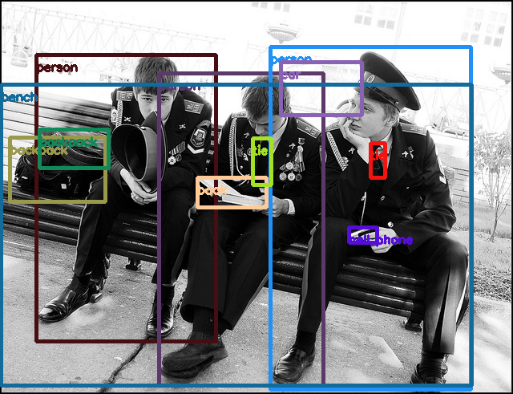
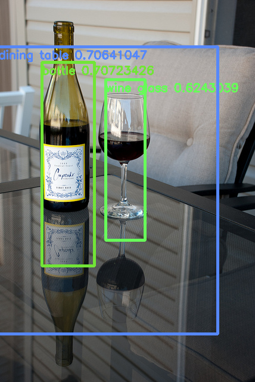
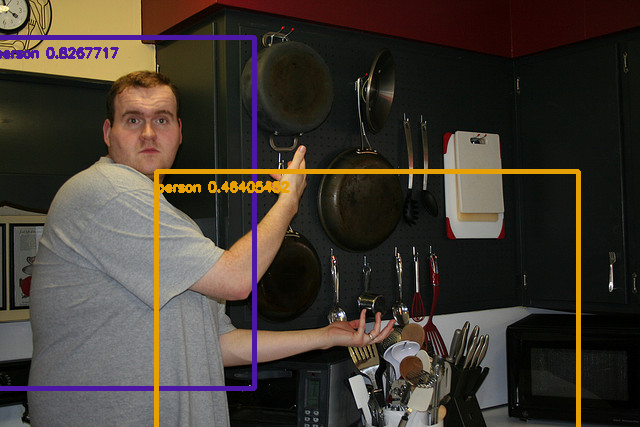
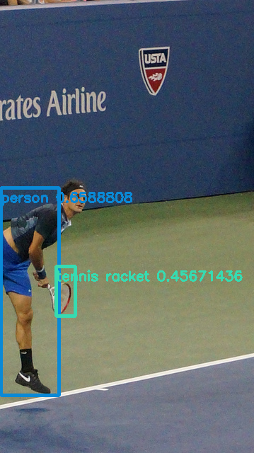
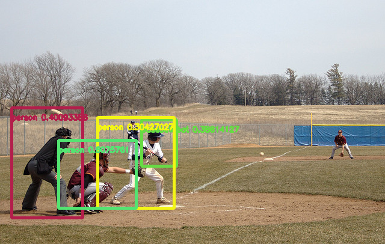
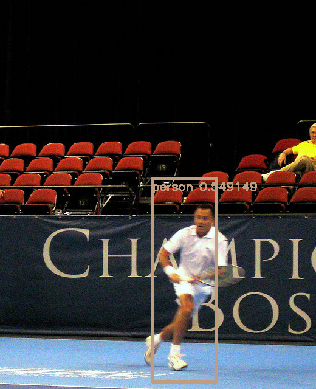
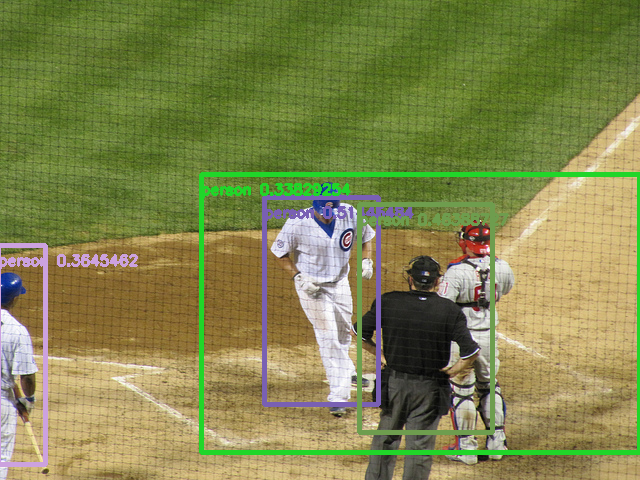

# Project
Pytorch version of the experiencor's keras YOLOv2 implementation https://github.com/experiencor/keras-yolo2 

## Getting Started

### Prepare the COCO dataset
create a folder for COCO dataset 
```
mkdir COCO/
cd COCO/
```
download the data from the COCO website by running: 
```
wget http://images.cocodataset.org/zips/train2014.zip 
wget http://images.cocodataset.org/zips/val2014.zip 
wget http://images.cocodataset.org/annotations/annotations_trainval2014.zip 
```
unzip all above zip files:
```
unzip train2014.zip
unzip val2014.zip
unzip annotations_trainval2014.zip 
```
create two subfolders in the COCO/ folder to store Pascal VOC format annotations:
```
mkdir train2014_annotations/ 
mkdir val2014_annotations/
```
git clone this repo to your computer and use the coco2pascal.py script to convert COCO annotation format to Pascal VOC format 
```
git clone https://github.com/shangranq/Yolov2-Pytorch.git
cd Yolov2_Pytorch/
python coco2pascal.py create_annotations COCO/ train COCO/train2014_annotations/ 
python coco2pascal.py create_annotations COCO/ val COCO/val2014_annotations/  
```

So far the dataset has been prepared and the data folder structure should be the same as:
``` 
├── COCO
     ├──train2014                    # training set images
     ├──val2014                      # validation set images
     ├──train2014_annotations        # Pascal VOC format training set annotation
     ├──val2014_annotations          # Pascal VOC format validation set annotation 
     |──annotations                  # original COCO annotation 
``` 

### Visualize the COCO dataset
Before we move to the model training and testing, we can visualize some sample images with anchor boxes and labels by runnnig
```
python util.py
```
The generated images will be saved in the sample/image_gt_box/ folder and here are some samples:
 
 


## train the model
To train the model, run:
```
python train.py -c config.json
```
The config.json passes in the hyperparameters and data paths into the train.py script. To fine tune the hyperparameters, you only need to change the config.json, which looks like below 
```
{
    "model" : {
        "backend":              "ResNet",
        "input_size":           416,
        "anchors":              [0.57273, 0.677385, 1.87446, 2.06253, 3.33843, 5.47434, 7.88282, 3.52778, 9.77052, 9.16828], 
        "max_box_per_image":    50,        
        "labels":               ["bowl", "broccoli", "orange", "giraffe", "potted plant", "vase", "zebra", "umbrella",
                                "person", "horse", "elephant", "car", "truck", "stop sign", "clock", "train", "skateboard",
                                "airplane", "knife", "oven", "microwave", "book", "fork", "cake", "dog", "bench", "chair",
                                "pizza", "dining table", "cup", "spoon", "handbag", "refrigerator", "sink",       
                                "bottle","banana","sandwich", "kite", "tie", "scissors", "snowboard", "bus", "suitcase", 
                                "frisbee", "wine glass","teddy bear", "hot dog", "carrot", "sports ball", "skis", "backpack", 
                                "couch", "mouse", "remote","laptop", "boat", "tennis racket", "donut", "cat", "traffic light", 
                                "bed", "motorcycle", "bicycle","cell phone", "toilet", "toothbrush", "tv", "apple", 
                                "surfboard", "keyboard", "bird", "fire hydrant","cow", "baseball bat", "sheep", "bear", 
                                "baseball glove", "toaster", "parking meter", "hair drier"]
    },

    "train": {
        "train_image_folder":   "/data/datasets/COCO/train2014/",
        "train_annot_folder":   "/data/datasets/COCO/train2014_annotations/",     
          
        "pretrained_weights":   "",
        "batch_size":           16,
        "learning_rate":        1e-4,
        "nb_epochs":            30,
        "object_scale":         5.0,
        "no_object_scale":      1.0,
        "coord_scale":          1.0,
        "class_scale":          1.0,
        "warmup_epochs":        100,
        "saved_weights_name":   "ResNet_COCO.pth",
        "debug":                false
    },

    "valid": {
        "valid_image_folder":   "",
        "valid_annot_folder":   ""
    },

    "test": {
        "test_image_folder":   "/data/datasets/COCO/val2014/",
        "test_annot_folder":   "/data/datasets/COCO/val2014_annotations/"
    }
}
```
During training, if you set "debug" with True, each component of the loss, including loss_xy, loss_wh, loss_conf, loss_class, along with the recall of predictions for each mini-batch of data will be printed for you to debug the system. The selection of hypermarameters of the system is sensitive on the choice of backends and the task itself. You can learn more by playing with the hyperparameters and monitoring the trend of recall and loss. 

At the end of training, evaluation of mAP will be performed afterwards and some sample testing images with predicted bounding boxes will be saved in /sample/image_pred_box/ folder. 

## evaluate the model
To evaluate the model performance on testing set, run
```
python test.py -c config.json
```
mAP will be printed for each class and for all classes, this implementation's overall mAP is 0.1896. 

Currently, I am systematically performing experiments with various backends and will fill out the table below. 

| Backend       | mAP (IOU=0.3)     | mAP (IOU=0.5)    |
| :------------- | :----------: | -----------: |
|  MobileNet | NA               | NA      |
| ResNet     | NA               | NA      |
| Full Yolo  | NA               | NA      |


## Perform detection using trained weights on an image by running
```
python predict.py -c config.json -w /path/to/best_weights.pth -i /path/to/image/or/video
```
It carries out detection on the image and write the image with detected bounding boxes to the same folder.

Some of the testing images with predicted bounding boxes will be saved in the sample/ folder with file name "test*.png".
Here are some samples of predictions for Yolo with Resnet50 backend. 

 
 


# Appendix
| Variable name       | shape     | meaning    |
| :------------- | :---------- | :----------- |
|  cell_grid |  (batch_size, grid_h, grid_w, nb_box, 2) |  cell_grid[:, i, j, :, :] = [j, i] the upper_left corner locations of all cells in the grid scale where each cell has length 1    |
| y_pred     | (batch_size, grid_h, grid_w, nb_box, 85) | output from the model with 85 channels, the first 4 channels are x, y, w, h, the 5th channel is the object confidence, the last 80 channels are 80 probabilities for all categories      |
| y_true     | (batch_size, grid_h, grid_w, nb_box, 85) | ground truth tensor from data loader |
| pred_box_xy     | (batch_size, grid_h, grid_w, nb_box, 2) | predicted x and y locations of the center of the bounding boxes  |
| pred_box_wh     | (batch_size, grid_h, grid_w, nb_box, 2) | predicted widths and heights of the bounding boxes  |
| pred_box_conf   | (batch_size, grid_h, grid_w, nb_box) | predicted object confidence of the bounding boxes range from 0 to 1 |
| pred_box_class  | (batch_size, grid_h, grid_w, nb_box, 80) | predicted class probabilities of the bounding boxes |
| true_box_xy     | (batch_size, grid_h, grid_w, nb_box, 2) | true x and y locations of the center of the bounding boxes |
| true_box_wh     | (batch_size, grid_h, grid_w, nb_box, 2) | true widths and heights of the bounding boxes |
| true_box_conf   | (batch_size, grid_h, grid_w, nb_box) | true widths and heights of the bounding boxes |


